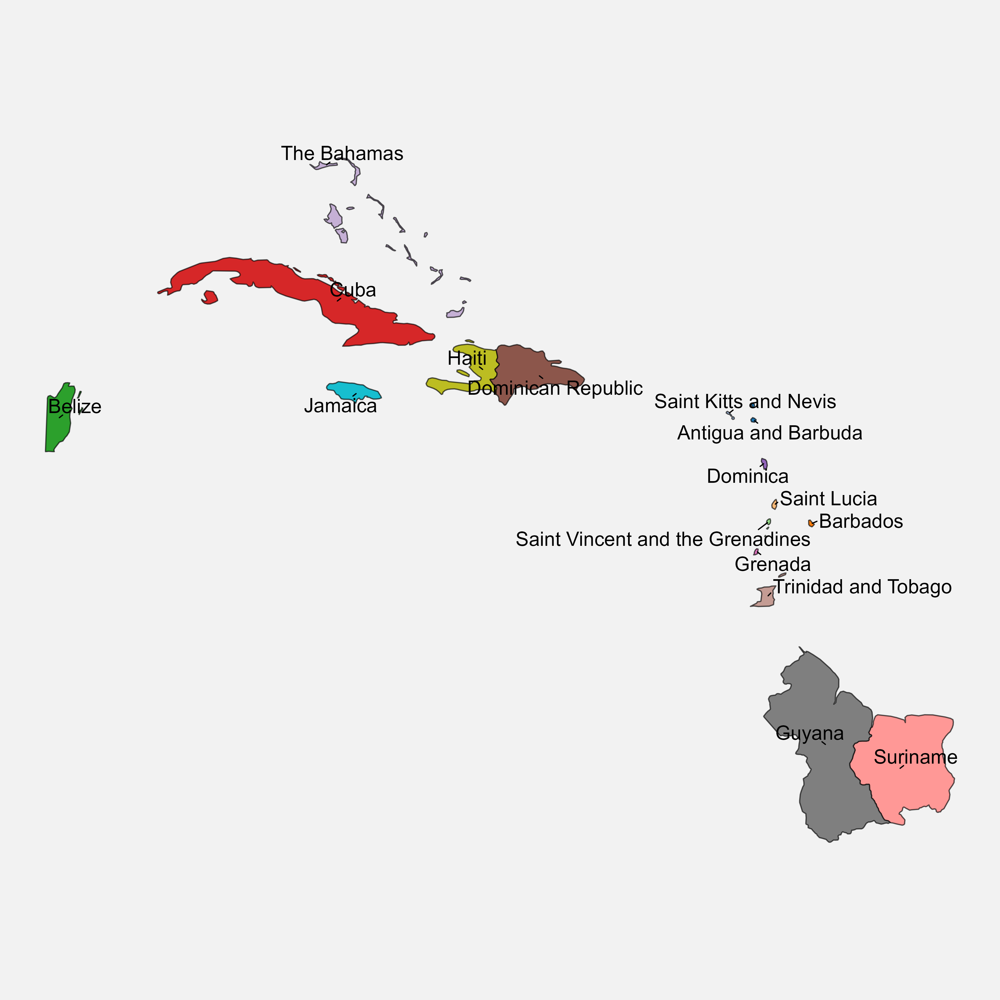
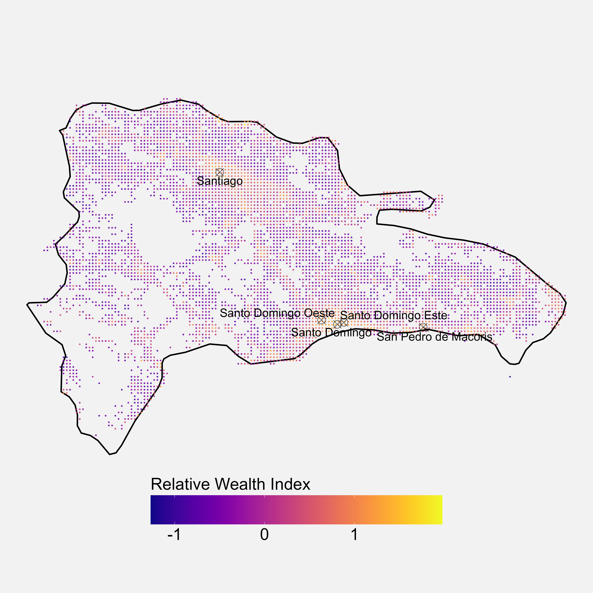

# Caribbean Data Visualizations

This repository contains a collection of data visualizations about various topics related to the Caribbean. 
The visualizations have been created using various tools and software, and they are meant to provide a concise explanation of various phenomena to policymakers and the general public.

## Example visualizations

### 1) Cultural Caribbean Map

[Code](sub_pro_1_carib_data/r_scripts/cultural_caribbean_map.R)

### 2) Relative Wealth Index in the Dominican Republic

[Code](sub_pro_2_rel_wealth_index_carib_meta/r_scripts/relative_wealth_index_caribbean.R)

